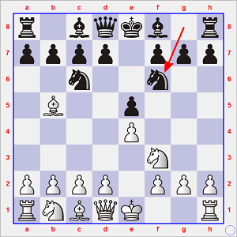
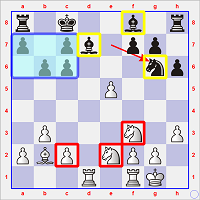
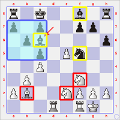
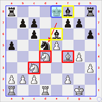
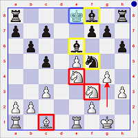

## Encadré : en 2000, Kramnik reconstruisit le Mur de Berlin

**1. e4 e5 2. Cf3 Cc6 3. Fb5 Cf6**

<table>
<tr>
<td colspan="11"><b>1ère du match</b> : Kasparov - Kramnik, à Londres, le 8 octobre 2000 (nulle en 25 coups)</td>
</tr>
<tr align="center">
<td>4.</td>
<td>5.</td>
<td>6.</td>
<td>7.</td>
<td>8.</td>
<td>9.</td>
<td>10.</td>
<td>11.</td>
<td>12.</td>
<td>13.</td>
<td>14.</td>
</tr>
<tr align="right">
<td>O-O Cxe4</td>
<td>d4 Cd6</td>
<td>Fxc6 dxc6</td>
<td>dxe5 Cf5</td>
<td>Dxd8+ Rxd8</td>
<td>Cc3 Fd7</td>
<td>b3 h6</td>
<td>Fb2 Rc8</td>
<td>h3 b6</td>
<td>Tad1 Ce7</td>
<td>Ce2 Cg6</td>
</tr>
<tr>
<td colspan="11">&nbsp;</td>
</tr>
<tr>
<td colspan="11"><b>3ème du match</b> : Kasparov - Kramnik, à Londres, le 12 octobre 2000 (nulle en 53 coups)</td>
</tr>
<tr align="center">
<td>4.</td>
<td>5.</td>
<td>6.</td>
<td>7.</td>
<td>8.</td>
<td>9.</td>
<td>10.</td>
<td>11.</td>
<td>12.</td>
<td>13.</td>
<td>14.</td>
</tr>
<tr align="right">
<td align="center">.. ..</td>
<td align="center">.. ..</td>
<td align="center">.. ..</td>
<td align="center">.. ..</td>
<td align="center">.. ..</td>
<td align="center">.. ..</td>
<td align="center">.. ..</td>
<td align="center">.. ..</td>
<td><b>Tad1</b> b6</td>
<td>Ce2 c5</td>
<td>c4 Fc6</td>
</tr>
<tr>
<td colspan="11">&nbsp;</td>
</tr>
<tr>
<td colspan="11"><b>9ème du match</b> : Kasparov - Kramnik, à Londres, le 22 octobre 2000 (nulle en 30 coups)</td>
</tr>
<tr align="center">
<td>4.</td>
<td>5.</td>
<td>6.</td>
<td>7.</td>
<td>8.</td>
<td>9.</td>
<td>10.</td>
<td>11.</td>
<td>12.</td>
<td>13.</td>
<td>14.</td>
</tr>
<tr align="right">
<td align="center">.. ..</td>
<td align="center">.. ..</td>
<td align="center">.. ..</td>
<td align="center">.. ..</td>
<td align="center">.. ..</td>
<td>.. <b>h6</b></td>
<td>Td1+ Re8</td>
<td>h3 a5</td>
<td>Ff4 Fe6</td>
<td>g4 Ce7</td>
<td>Cd4 Cd5</td>
</tr>
<tr>
<td colspan="11">&nbsp;</td>
</tr>
<tr>
<td colspan="11"><b>13ème du match</b> : Kasparov - Kramnik, à Londres, le 29 octobre 2000 (nulle en 14 coups)</td>
</tr>
<tr align="center">
<td>4.</td>
<td>5.</td>
<td>6.</td>
<td>7.</td>
<td>8.</td>
<td>9.</td>
<td>10.</td>
<td>11.</td>
<td>12.</td>
<td>13.</td>
<td>14.</td>
</tr>
<tr align="right">
<td align="center">.. ..</td>
<td align="center">.. ..</td>
<td align="center">.. ..</td>
<td align="center">.. ..</td>
<td align="center">.. ..</td>
<td>.. h6</td>
<td><b>h3</b> Re8</td>
<td>Ce4 c5</td>
<td>c3 b6</td>
<td>Te1 Fe6</td>
<td>g4 (<b>1/2</b>)</td>
</tr>
</table>

### Comparaison des quatre positions

De gauche à droite :  

* Partie &nbsp;1 : après 14... Cg6
* Partie &nbsp;3 : après 14... Fc6
* Partie &nbsp;9 : après 14... Cd5
* Partie 13 : position finale (après 14. g4)

   

Dans les Parties 1 et 3, le Roi noir a choisi **refuge derrière le massif de pions noirs** de l'Aile Dame.  
Après un coup tel que Rc8-b7, la Ta8 peut gagner le centre.  
Les deux Fous noirs sont sur des diagonales ouvertes.  
Les Cavaliers blancs doivent être redéployés vers des cases leur offrant davanrage d'activité, ce qui leur est source de pertes de `tempi` - et, donc : ce qui devient un facteur d'égalisation du jeu pour les Noirs, puisque les Blancs perdent toute `initiative`. 

Après une césure de six parties, Kramnik introduit un deuxième `thème d'ouverture` dans la Défense de Berlin de la Partie Espagnole (Ruy Lopez) en maintenant contre toute attente **son Roi au centre** (sur l'échec 10. Td1+ dans la 9ème, et de sa propre initiative dans la 13ème).  
L'idée est ici que les Fous noirs, toujours pleinement libres de leurs mouvements, ainsi que le Cavalier se placent de telles manière à embouteiller le passage des forces blanches par le centre de l'échiquier.  
Le Fe6 en particulier se poste en `bélier` efficace en vis-à-vis du pion e5, de sorte que toute progression vers le *Mur de Berlin* est, sinon impossible, du moins fortement ralentie.  
&Agrave; nouveau, ce sont les pertes de `tempi` des Blancs qui permettent l'égalisation de la position : ce que constatera Kasparov de lui-même dans la 13ème, puisque après **14. g4** (permettant sans doute la man&oelig;uvre Cf5-e7-d5 ou [en cas de c3-c4] Cf5-e7-c6-d4 ou b4) les Noirs maîtrisent sans problème une structure de pions blanche à l'Aile Roi dépourvue de coordination et de tonus.

### Le match en un coup d'oeil

(résultats en gras = résultats avec les Blancs)

<table align="center">
<tr>
<td>&nbsp;</td>
<td><b>01</b></td>
<td><b>02</b></td>
<td><b>03</b></td>
<td><b>04</b></td>
<td><b>05</b></td>
<td><b>06</b></td>
<td><b>07</b></td>
<td><b>08</b></td>
<td><b>09</b></td>
<td><b>10</b></td>
<td><b>11</b></td>
<td><b>12</b></td>
<td><b>13</b></td>
<td><b>14</b></td>
<td><b>15</b></td>
<td>&nbsp;</td>
</tr>
<tr>
<td>Kasparov</td>
<td><b>=</b></td>
<td>0</td>
<td><b>=</b></td>
<td>=</td>
<td><b>=</b></td>
<td>=</td>
<td><b>=</b></td>
<td>=</td>
<td><b>=</b></td>
<td>0</td>
<td><b>=</b></td>
<td>=</td>
<td><b>=</b></td>
<td>=</td>
<td><b>=</b></td>
<td><b>6,5</b></td>
</tr>
<tr>
<td>Kramnik</td>
<td>=</td>
<td><b>1</b></td>
<td>=</td>
<td><b>=</b></td>
<td>=</td>
<td><b>=</b></td>
<td>=</td>
<td><b>=</b></td>
<td>=</td>
<td><b>1</b></td>
<td>=</td>
<td><b>=</b></td>
<td>=</td>
<td><b>=</b></td>
<td>=</td>
<td><b>8,5</b></td>
</tr>
<tr align="right">
<td>&nbsp;</td>
<td>C67 25.</td>
<td>D85 40.</td>
<td>C67 53.</td>
<td>D27 74.</td>
<td>A34 24.</td>
<td>D27 66.</td>
<td>A32 11.</td>
<td>E32 38.</td>
<td>C67 30.</td>
<td>E54 25.</td>
<td>C78 41.</td>
<td>E55 33.</td>
<td>C67 14.</td>
<td>A30 57.</td>
<td>E05 38.</td>
<td>&nbsp;</td>
</tr>
</table>

-----

* **A30** = 1. Cf3 (Reti Opening)
* **A32** = 1. c4 c5 2. Cf3 Cf6 3. d4 (English Symmetrical Benoni Formation)
* **A34** = 1. c4 c5 (English Symmetrical Variation)
* **C67** = 1. e4 e5 2. Cf3 Cc6 3. Fb5 Cf6 4. O-O Cxe4 (Ruy Lopez Berlin Defense Open Variation)
* **C78** = 1. e4 e5 2. Cf3 Cc6 3. Fb5 a6 4. Fa4 Cf6 5. O-O (Ruy Lopez (5.O-O))
* **D27** = 1. d4 d5 2. c4 dxc4 3. Cf3 (Queen's Gambit Accepted (3.Nf3))
* **D85** = 1. d4 Cf6 2. c4 g6 3. Cc3 d5 4. cxd5 Cxd5 5. e4 Cxc3 6. bxc3 Fg7 7. Cf3 (Grünfeld Moderne Exchange Variation)
* **E05** = 1. d4 Cf6 2. c4 e6 3. g3 d5 4. Fg2 Fe7 5. Cf3 (Catalan Closed (5.Nf3))
* **E32** = 1. d4 Cf6 2. c4 e6 3. Cc3 Fb4 4. Dc2 (Nimzo-Indian Defense Classical Variation)
* **E54** = 1. d4 Cf6 2. c4 e6 3. Cc3 Fb4 4. e3 O-O 5. Fd3 d5 (Nimzo-Indian Defense (4.e3 O-O 5.Bd3 d5))
