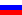
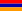

## Echecs - Tournoi de Wijk aan Zee  2000

> Du 14 au 30 janvier 2000

[Palmarès](http://www.freewebs.com/bobjr-2000/Sports_2000/Palmares_Wijk_aan_Zee.html) des Tournois _Hoogovens_

#### Parties

- [Ronde 1](http://www.freewebs.com/bobjr-2000/Sports_2000/wijk_R01.html)
- [Ronde 2](http://www.freewebs.com/bobjr-2000/Sports_2000/wijk_R02.html)
- [Ronde 3](http://www.freewebs.com/bobjr-2000/Sports_2000/wijk_R03.html)
- [Ronde 4](http://www.freewebs.com/bobjr-2000/Sports_2000/wijk_R04.html)

#### Classement final

| &nbsp; | &nbsp; | &nbsp; |
| ---: | --- | ---: |
| 1° | Gari **KASPAROV**  | 9,5 Pts |
| 2° | Viswanathan ANAND  | 8,0 Pts |
| &nbsp; | Vladimir KRAMNIK  | 8,0 Pts |
| &nbsp; | Peter LEKO  | 8,0 Pts |
| 5° | Alexander MOROZEVITCH  | 7,5 Pts |
| 6° | Michael ADAMS  | 7,0 Pts |
| 7° | Jeroen PIKET  | 6,5 Pts |
| &nbsp; | Jan TIMMAN  | 6,5 Pts |
| 9° | Predrag NIKOLIC  | 6,0 Pts |
| 10° | Nigel SHORT  | 5,5 Pts |
| 11° | Viktor KORTCHNOÏ  | 5,0 Pts |
| &nbsp; | Judit POLGAR  | 5,0 Pts |
| 13° | Smbat LPOUTIAN  | 4,5 Pts |
| 14° | Loek VAN WELY  | 4,0 Pts |
